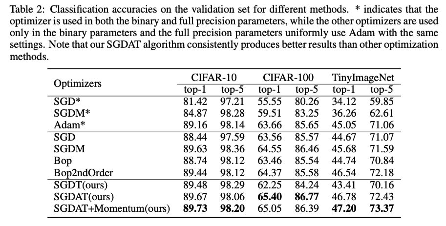

# SGDAT
SGDAT: An Optimization Method for Binary Neural Networks

The code is based on https://github.com/itayhubara/BinaryNet.pytorch.  
Please install torch and torchvision by following the instructions at: http://pytorch.org/.   

### Run Command

#### Adam in cifar100
python main_binary.py --model vgg_cifar100_binary --save test/vgg_cifar100_Adam --dataset cifar100 --bin_regime "{0: {'optimizer': 'Adam','lr':1e-3}}"  --binarization det --input_size 32 --epochs 200 -b 256

#### SGD in cifar100
!python main_binary.py --model vgg_cifar100_binary --save test/vgg_cifar100_SGD --dataset cifar100 --bin_regime "{0: {'optimizer': 'SGD','lr':1e-4}}"  --binarization det --input_size 32 --epochs 200 -b 256

### Experimental Result

